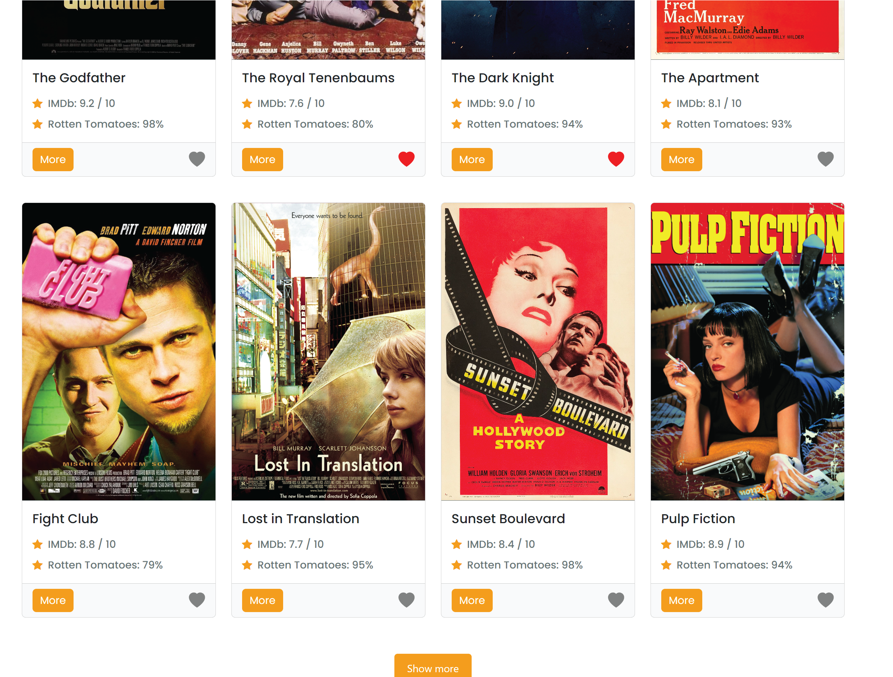
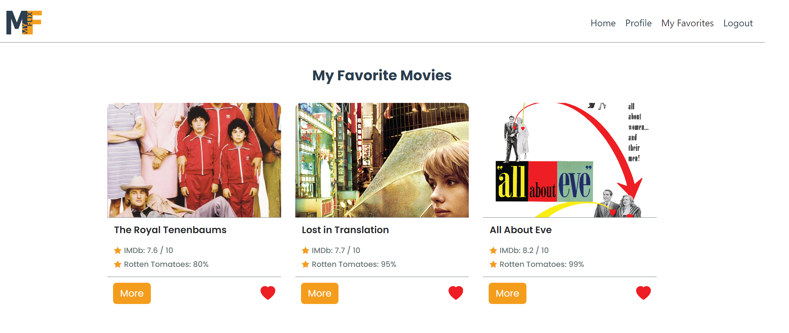
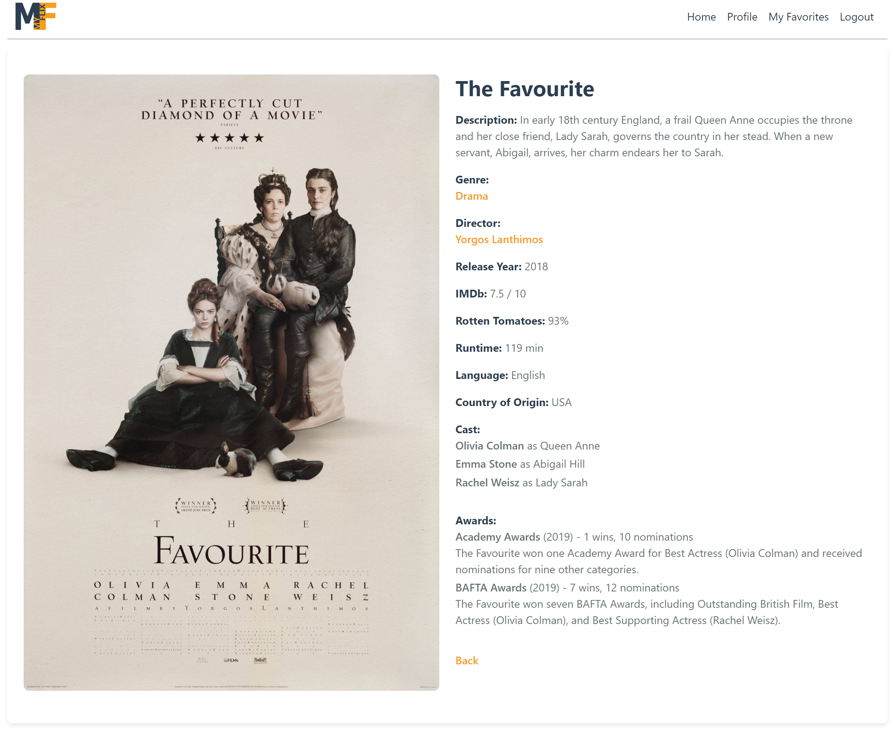
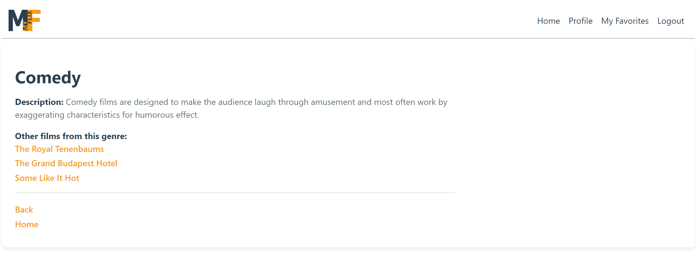

# MyFlix

## About

Myflix provides users with information about different movies, directors, and genres.
Users can sign up, log in, update their account information and manage a list of their fav movies.
This project was built with the MERN (MongoDB, Express, React, and Node.js) stack.

Website [here](https://myflix-morefilms.netlify.app/).

## Project requirements

The project brief extracted several mandatory functions from the user stories that needed to be implemented:

1. Return a list of ALL movies to the user
2. Return data (description, genre, director, image URL, whether it’s featured or not) about a single movie by title to the user
3. Return data about a genre (description) by name/title (e.g., “Thriller”)
4. Return data about a director (bio, birth year, death year) by name
5. Allow new users to register
6. Allow users to update their user info (username, password, email, date of birth)
7. Allow users to add a movie to their list of favourites
8. Allow users to remove a movie from their list of favourites
9. Allow existing users to deregister

The **server side** of the web application consists of a REST API and a database built with JavaScript, Node.js, Express, and MongoDB. The
REST API can be accessed via commonly used HTTP methods like GET, PUT, POST and DELETE. CRUD methods are used to retrieve data from the database and store that
data in a non-relational way. I used Postman for endpoint testing and Mongoose for the business layer logic. The database was built with MongoDB.

## Used

The following technologies are used:
MongoDB,
Express,
React,
Node.js,
React Redux,
React Bootstrap,
Parcel
